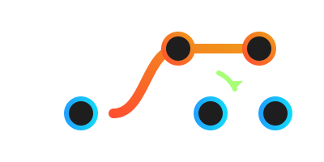
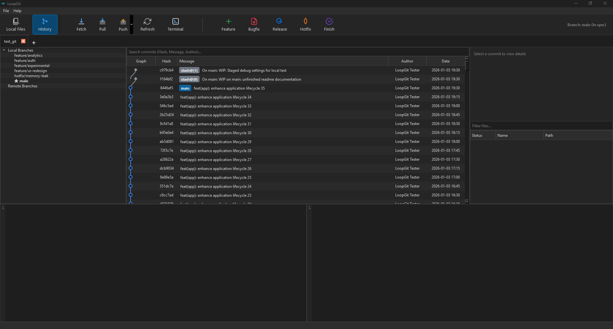

<div align="center">
  
  <h1>LoopGit</h1>
  <p><b>A Fast, Lightweight, and Native Git GUI Client for Developers</b></p>
  
  [](https://isocpp.org/)
  [](https://www.qt.io/)
  [](LICENSE)
</div>

<br>

## Overview

LoopGit is a fast, lightweight, and native Git GUI client built with C++17, Qt 6, and libgit2. Designed specifically for low resource consumption and maximum responsiveness, it starts instantly, consumes minimal memory (typically under 50MB RAM), and delivers a distraction-free environment for everyday version control operations.

## Key Features

- **Interactive Git Revision Graph:** Deterministic lane-based graph rendering with continuous cubic Bézier splines and dedicated branch tracks (GitExtensions standard).
- **Tabbed Repository Management:** Work across multiple Git repositories simultaneously with independent state and navigation tabs.
- **Visual Conflict Resolver:** Interactive split-view editor to inspect and resolve merge conflicts with one-click resolution ("Ours", "Theirs", or "Both").
- **Commit Comparison & History Diffs:** Select any two commits to inspect mutual differences, file status changes, and unified diff syntax highlighting.
- **Live Branch Sync Indicators:** At-a-glance visual indicators displaying upstream ahead/behind commit counters (`[↑X ↓Y]`).
- **Reflog & Blame Inspector:** Deep repository analysis tools including local reflog inspection and line-by-line blame attribution.
- **Git Flow Integration:** Quick actions to initiate and manage feature, bugfix, release, and hotfix branches.
- **Stash Management:** Clean visualization of working directory snapshots and stash operations.

## Screenshots

<div align="center">
  
</div>

## Tech Stack & Architecture

- **Core Language:** C++17
- **Framework:** Qt 6 (Widgets, Network, Svg, Concurrent)
- **Git Engine:** libgit2 (Direct native C API bindings)
- **Build System:** CMake (>= 3.16)
- **CI/CD:** GitHub Actions (Multi-platform release automation)
- **Windows Packaging:** Inno Setup (`.exe` installer)
- **Linux Packaging:** Standalone `.deb` (Debian 12+, Ubuntu 22.04+) & AppImage

The application architecture utilizes direct libgit2 in-memory objects to avoid process spawning overhead. Long-running repository operations execute asynchronously using Qt Concurrent to keep the UI silky smooth and responsive.

## Build Instructions

### Prerequisites
- Qt 6.5+ (Widgets, Network, Svg, Concurrent)
- CMake 3.16+
- C++17 compatible compiler (MSVC 2019+, GCC, or Clang)
- libgit2 (auto-detected via vcpkg/system or fetched via FetchContent)

### Compilation Steps

1. Clone the repository:
   ```bash
   git clone https://github.com/hakanyz/loopgit.git
   cd loopgit
   ```

2. Configure and build:
   ```bash
   mkdir build && cd build
   cmake -DCMAKE_BUILD_TYPE=Release ..
   cmake --build . --config Release
   ```

3. Run the executable:
   - **Windows**: `.\build\Release\LoopGit.exe`
   - **Linux / macOS**: `./build/LoopGit`

## Linux Installation (.deb Package)

LoopGit distributes a standalone `.deb` package with bundled runtime libraries for seamless compatibility across **Debian 12+**, **Ubuntu 22.04+**, and newer distributions without external Qt dependency conflicts:

```bash
sudo apt install ./LoopGit-*.deb
```

This automatically installs the binary to `/opt/loopgit`, links it to `/usr/bin/loopgit`, and configures the desktop launcher and system application icons.

## Keyboard Shortcuts

| Shortcut | Action |
| --- | --- |
| `Ctrl + O` | Open Local Repository |
| `Ctrl + W` | Close Current Tab |
| `Ctrl + F` | Fetch from Remote |
| `Ctrl + P` | Push to Remote |
| `Ctrl + Shift + P` | Pull from Remote |
| `Ctrl + Shift + C` | Focus Commit Message Box |
| `Ctrl + Return` | Commit Staged Changes |

## License

This project is licensed under the GNU General Public License v3.0 - Copyright (c) 2026 Hakan (hakanyz). See the [LICENSE](LICENSE) file for details.
